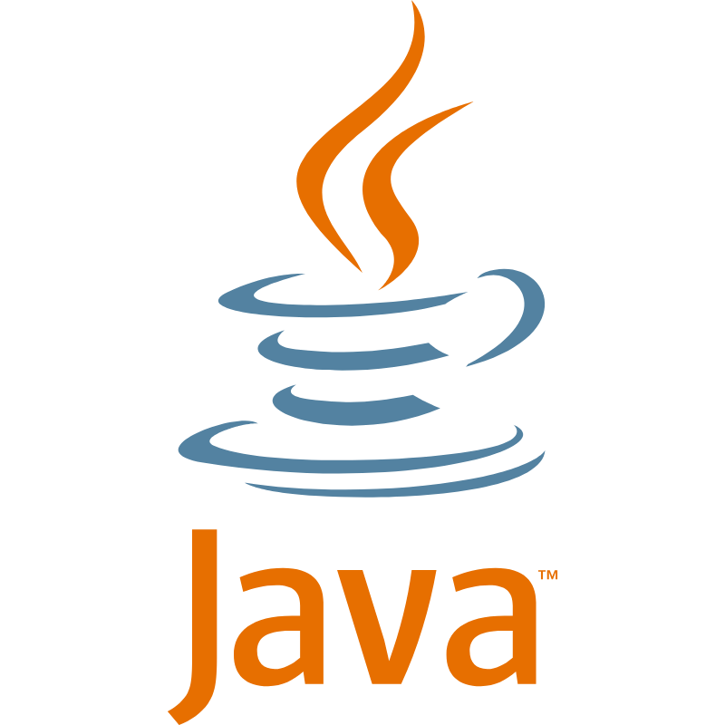
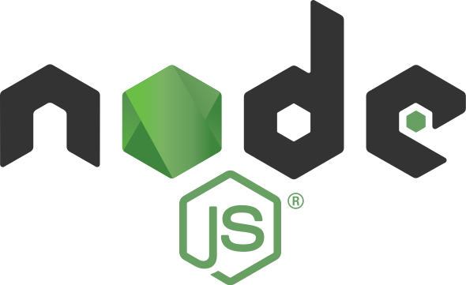

# Carlos Martínez Crespo Github :octocat:

## 💁 About me

### Hi! After more than 8 years as a technical consultant and IT coordinator I decided to change my life and start working about I really passionate me, programming. It was a hard decision, but now I can say I did the right thing, because you have to fight for what you are passionate about, and overall, you have to work on something that motivates you and makes you improve every day

### Nowadays I am working as Software Developer at Atradius since 10th July 2023.

### Next Digital Hub (consulting startup) was my previous job. Mainly we work in responsive web applications with a modern stack (Backend: Spring Boot - Frontend: VUE), applying continuous integration with GitLab CI. Back is tested (unit, integration and acceptance tests) with JUnit, Mockito and Object Mother pattern

## 💻 Backend Skills

> MAIN LANGUAGE
> 
>    

> OTHER LANGUAGES
> 
>  

### You can reach through to my <a href="https://www.linkedin.com/in/carlos-martinez-crespo/" target="_blank">LinkedIn</a>

---

## 📊 My GitHub Stats

| :mechanical_arm:                                                                                                        | :mechanical_leg:                                                                                                                           |
| ----------------------------------------------------------------------------------------------------------------------- | ------------------------------------------------------------------------------------------------------------------------------------------ |
|  |  |

 

 

  

  

<a> 
    
  
   
</a>

<!--
**N1b3lung0/N1b3lung0** is a ✨ _special_ ✨ repository because its `README.md` (this file) appears on your GitHub profile.

Here are some ideas to get you started:

- 🔭 I’m currently working on ...
- 🌱 I’m currently learning ...
- 👯 I’m looking to collaborate on ...
- 🤔 I’m looking for help with ...
- 💬 Ask me about ...
- 📫 How to reach me: ...
- 😄 Pronouns: ...
- ⚡ Fun fact: ...
-->
